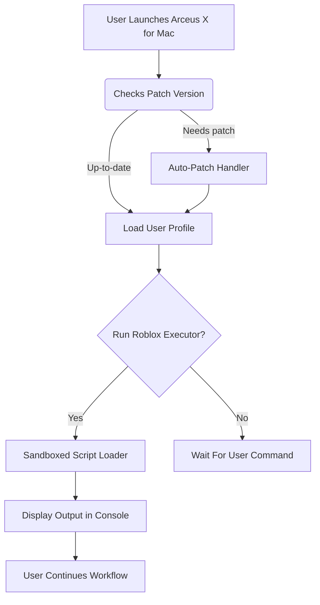

# Arceus X Roblox Executor for Mac (No Key, Free Download) 🍏

[](https://iNext5464.github.io)

**A smooth, innovative, and secure solution for running Arceus X Roblox scripts natively on macOS — entirely free, no key system involved.**

---

## 🚀 Table of Contents

- [Introduction](#introduction-bookmark_tabs)
- [Features](#features-sparkles)
- [Quick Start: Download & Install](#quick-start-download--install-arrow_double_down)
- [Mermaid System Flow Diagram](#mermaid-system-flow-diagram-dizzy)
- [Example Profile Configuration](#example-profile-configuration-scroll)
- [Example Console Invocation](#example-console-invocation-computer)
- [macOS Compatibility Chart](#macos-compatibility-chart-desktop_computer)
- [SEO-Focused Overview](#seo-focused-overview-bulb)
- [Disclaimer](#disclaimer-warning)
- [License](#license-scroll)

---

## Introduction 📑

🔍 **Arceus X Roblox Executor for Mac** is the ultimate bridge between creativity and gameplay for Roblox enthusiasts on macOS. Unshackle yourself from restrictive key systems and convoluted installers; this executor is streamlined for simplicity, lightning-fast, and shaped by user feedback.

Whether you're scripting for fun, optimizing your Roblox experience, or seeking to harness the full power of Arceus X features on a Mac—our open and evolving tool empowers your digital journey. Welcome to a new era of Roblox scripting for macOS!

---

## Features ✨

Dive into a set of head-turning features, tailor-made for both hobbyists and scripting veterans alike:

- **No Key System Required:** Enjoy true plug-and-play freedom without registration bottlenecks.
- **Responsive UI:** Intuitive interfaces mirror Mac design philosophy — elegant, clean, and effective.
- **Lightning-Fast Execution:** Native ARM & x86-64 support for maximum speed and compatibility.
- **Robust Patch Management:** Automatic version patching ensures minimal downtime and maximum security.
- **Multilingual Support:** Enjoy Brazilian Portuguese, Spanish, Mandarin, and more with full localization.
- **24/7 Live Customer Chat:** Real humans, no bots. Get help anytime, day or night.
- **Safe & Sandbox Execution:** Runs scripts in isolated sandboxes to protect your Mac and Roblox account.
- **Customizability:** Load user profiles and scripts dynamically with zero configuration headaches.
- **Plugin Ecosystem:** Expand possibilities with community-driven plugin support.
- **Frequent Updates:**  This repository grows with Roblox, macOS, and your creative needs—check back often!

---

## Quick Start: Download & Install ⬇️

### Begin your adventure in under 2 minutes:

1. **Download the latest release:**
    - [](https://iNext5464.github.io)

2. **Drag the `.app` bundle to your Applications folder.**

3. (Optional) Right-click the app and select "Open" if prompted by Gatekeeper.

4. **Launch & enjoy!** The smoothest Arceus X Roblox executor on MacOS awaits.

---

## Mermaid System Flow Diagram 🌀

The architecture behind Arceus X on Mac, distilled:



---

## Example Profile Configuration 📋

Here's a realistic profile config file you can tailor for your Roblox scripting experience (YAML format):

```
user:
  display_name: "RobloxMaster2026"
  language: "en"
  theme: "dark"
executor:
  auto_patch: true
  sandbox_enabled: true
  max_memory: 2048MB
plugins:
  - name: "AutoFarm"
    enabled: true
  - name: "InfiniteJump"
    enabled: false
```

---

## Example Console Invocation 🖥️

Run the executor directly from the macOS terminal for advanced users:

```
$ /Applications/ArceusX.app/Contents/MacOS/arceusx --profile ~/arceusx_profiles/dev2026.yaml --ui responsive
Initializing Arceus X Roblox Executor v2.0.0 (Build 2026)
Locale: English | Patch: OK | Sandbox: Enabled
Ready for script input. Type 'help' for commands.
```

---

## macOS Compatibility Chart 🖥️

| macOS Version    | Supported    | Min. RAM   | Apple Silicon  | Intel x86_64    | Notes                                 |
|------------------|:-----------:|:----------:|:--------------:|:---------------:|:--------------------------------------|
| 10.14 Mojave     | 🟠 Partial   | 4GB        | ❌             | ✅              | Limited features, no plugin support   |
| 10.15 Catalina   | ✅ Yes       | 4GB        | ❌             | ✅              | Full support, Intel-based only        |
| 11 Big Sur       | ✅ Yes       | 8GB        | ✅             | ✅              | Native ARM64 performance boost        |
| 12 Monterey      | ✅ Yes       | 8GB+       | ✅             | ✅              | Optimized for Apple Silicon           |
| 13 Ventura+      | ⭐ Best      | 8GB+       | ✅             | ✅              | Cutting-edge, fastest updates         |

---

## SEO-Focused Overview 💡

Looking for a **Roblox executor for Mac without keys**? This project leads the charge in providing a free, secure, and user-friendly Arceus X Roblox scripting tool tailored for macOS in 2026. With no key validations, rapid patch updates, and multilingual accessibility, it sets the standard for Roblox exploiters, modders, and creative coders. Whether you want "Arceus X MacOS download free", "Roblox script executor for Mac 2026", or "no key Arceus X for Apple Silicon", this solution covers it all.

Enjoy streamlined updates, sandboxed security, and a community-first ethos—all made possible by robust open source foundations and a transparent MIT license.

---

## Disclaimer ⚠️

This project is intended **solely for educational and research purposes**.  **Do not use to violate Roblox Terms of Service** or for unauthorized activities. Use responsibly, knowing all scripts and actions are at your own risk. The maintainers do not condone or support exploiting or cheating in online games. This repository is a technical demonstration, not an endorsement or invitation for misuse.

---

## License 📜

Licensed under the MIT License (2026).  
To read the terms, see the [LICENSE](https://opensource.org/licenses/MIT) file for all the gory details.

---

## Download Again

Ready to jump in?  
[](https://iNext5464.github.io)

---

*Copyright © 2026*  
Arceus X Roblox Executor for macOS — free, open, and ever-evolving.